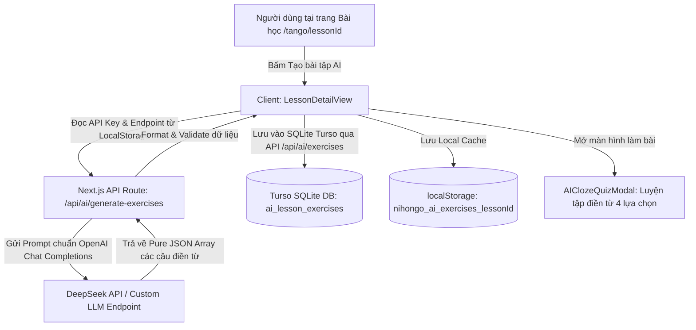

# Tài Liệu Thiết Kế: Tính Năng Tạo & Luyện Bài Tập Điền Từ Bằng AI (AI Cloze Exercises)

- **Ngày tạo:** 2026-09-04
- **Dự án:** Nihongo Master (Standalone Next.js App)
- **Tác giả:** AI Assistant & User Pair Programming
- **Trạng thái:** Chờ User duyệt thiết kế (Under Review)

---

## 1. Bối cảnh & Mục tiêu

### 1.1 Vấn đề
Hiện tại, ứng dụng đã có hệ thống ghi nhớ từ vựng qua Flashcard SRS (thuật toán SM-2) và các mini game Quizlet (Trắc nghiệm, Ghép thẻ, Xếp từ). Tuy nhiên, người học cần rèn luyện khả năng áp dụng từ vựng vào ngữ cảnh thực tế của câu văn tiếng Nhật.

### 1.2 Mục tiêu
Xây dựng phân hệ **Bài tập AI** cho phép:
1. Người dùng tự cấu hình AI Endpoint URL, API Key và Model (mặc định model `deepseek-chat` / `deepseek-v4-flash`).
2. Trong mỗi bài học từ vựng (`/tango/[lessonId]`), cung cấp tính năng sinh bài tập điền từ ngữ cảnh bằng AI (1 câu trắc nghiệm điền từ tương ứng với mỗi từ vựng của bài).
3. Lưu trữ bộ bài tập đã tạo vào cơ sở dữ liệu SQLite (Turso Cloud) gắn liền với mã đồng bộ `syncCode` (đồng thời cache ở `localStorage` để dùng offline).
4. Cung cấp giao diện làm bài tập điền từ tương tác tối ưu cho điện thoại: chọn 1 trong 4 đáp án, phát âm audio câu hoàn chỉnh, giải thích chi tiết ngữ cảnh, và đặc biệt có **nút bật/tắt hiển thị bản dịch tiếng Việt** để người học thử thách khả năng đọc hiểu ngữ cảnh tiếng Nhật thuần túy.
5. Cho phép tạo lại bài tập bất cứ lúc nào (ghi đè bộ câu hỏi cũ).

---

## 2. Kiến trúc Tổng thể (Architecture Overview)



---

## 3. Chi tiết các Phân hệ

### 3.1 Cấu hình AI tại Trang Cài đặt (`/settings`)
- **Vị trí**: Mục "Trí tuệ nhân tạo (AI Assistant)" trong `src/app/settings/page.tsx`.
- **Dữ liệu cấu hình**:
  - `endpointUrl`: URL gọi API (mặc định `https://api.deepseek.com/v1`).
  - `apiKey`: Khóa bí mật của người dùng (ẩn/hiện bằng icon mắt). Lưu tại `localStorage`, không đưa vào source code hay commit.
  - `modelName`: Tên model muốn gọi (mặc định `deepseek-chat` / `deepseek-v4-flash`).
  - `showTranslationInQuiz`: Tùy chọn mặc định có hiện bản dịch tiếng Việt trên câu hỏi khi làm bài hay không (mặc định: `true`).
- **Nút "Kiểm tra kết nối" (Test Connection)**: Gửi request thử nghiệm siêu ngắn để xác nhận endpoint và API key hoạt động chính xác.

### 3.2 Cơ sở dữ liệu SQLite (`src/db/schema.ts`)
Thêm bảng `ai_lesson_exercises`:
```typescript
export const aiLessonExercises = sqliteTable('ai_lesson_exercises', {
  id: text('id').primaryKey(), // `${lessonId}_${syncCode || 'local'}`
  lessonId: text('lesson_id').notNull(),
  syncCode: text('sync_code').notNull(),
  model: text('model').notNull(),
  totalExercises: integer('total_exercises').notNull(),
  exercisesData: text('exercises_data').notNull(), // JSON string của ClozeExerciseItem[]
  createdAt: integer('created_at').notNull(),
  updatedAt: integer('updated_at').notNull(),
});
```
- Khi thiết bị A tạo bài tập cho bài học `minna_1` với `syncCode = 'NH-12345'`, bài tập được lưu vào database.
- Thiết bị B khi nhập mã `NH-12345` sẽ tự động tải được bộ bài tập này về, không cần tốn thêm chi phí/token AI.

### 3.3 Proxy API & Prompt Engineering (`/api/ai/generate-exercises`)
- **Input (POST)**:
  ```json
  {
    "endpointUrl": "https://api.deepseek.com/v1",
    "apiKey": "sk-...",
    "model": "deepseek-chat",
    "lessonId": "minna_lesson_1",
    "lessonTitle": "Bài 1: Giới thiệu bản thân",
    "level": "N5",
    "words": [
      { "id": "minna_1_1", "word": "わたし", "reading": "わたし", "meaning": "tôi" }
    ]
  }
  ```
- **System Prompt**: Đóng vai trò là chuyên gia sư phạm tiếng Nhật, tạo câu văn ngữ cảnh tự nhiên phù hợp với cấp độ JLPT của bài học.
- **Output JSON Schema**:
  ```typescript
  export interface ClozeExerciseItem {
    id: string; // exercise uuid
    vocabId: string; // target word id
    targetWord: string; // từ đúng trong bài
    targetReading: string; // cách đọc hiragana
    sentence: string; // câu tiếng Nhật có chỗ trống: "（　　）はベトナム人です。"
    fullSentence: string; // câu đầy đủ: "わたしはベトナム人です。"
    translation: string; // "Tôi là người Việt Nam."
    options: string[]; // 4 lựa chọn [targetWord + 3 distractors] đã đảo ngẫu nhiên
    correctIndex: number; // chỉ số đáp án đúng (0..3)
    explanation: string; // giải thích ngắn gọn bằng tiếng Việt
  }
  ```
- **Xử lý Robustness**:
  - Hỗ trợ parser tự động gỡ bỏ Markdown code block ```json ... ```.
  - Tối ưu hóa prompt để tạo đầy đủ câu hỏi cho toàn bộ danh sách từ trong bài học.

### 3.4 Giao diện trong Bài học (`LessonDetailView.tsx`)
1. **Nút Điều khiển**:
   - Chưa tạo bài: Nút gradient `✨ Tạo bài tập AI` (tự động đếm số từ sẽ tạo).
   - Đang tạo: Spinner loading xoay và trạng thái vô hiệu hóa tránh click đúp.
   - Đã tạo:
     - Nút chính: `🎯 Luyện bài tập AI (X câu)`.
     - Nút phụ: `🔄 Tạo lại bài tập bằng AI` (hỏi xác nhận trước khi tạo lại).
2. **Modal Luyện tập Điền từ (`AIClozeQuizModal.tsx`)**:
   - **Tối ưu Mobile First**: Thiết kế dạng modal full-screen hoặc bottom drawer mượt mà.
   - **Thanh công cụ**:
     - Tiến độ (Câu x/y), ProgressBar, Điểm XP.
     - **Nút Chuyển đổi Hiển thị Bản Dịch (Translate Toggle)**: Icon con mắt `Eye` / `EyeOff` cho phép bật/tắt nhanh bản dịch tiếng Việt ngay trong lúc làm bài.
   - **Thẻ Câu hỏi**:
     - Câu tiếng Nhật với chỗ trống `（　　）` to, rõ ràng.
     - Bản dịch tiếng Việt (hiện hoặc ẩn tùy công tắc).
   - **4 Nút Đáp án**:
     - Kích thước to, dễ bấm ngón cái.
     - Phản hồi màu xanh (Đúng) / đỏ (Sai) ngay khi chọn.
     - Tự động phát âm câu đầy đủ khi trả lời (hỗ trợ nút nghe lại).
   - **Hộp Giải thích Ngữ cảnh**:
     - Giải thích lý do chọn từ và phân tích các đáp án sai.
   - **Màn hình Tổng kết (Summary)**:
     - Điểm số, độ chính xác %, số XP được cộng vào tài khoản, danh sách các câu làm sai.

---

## 4. Xử lý Trường hợp Đặc biệt (Edge Cases)

| Tình huống | Cách xử lý |
|---|---|
| Người dùng chưa nhập API Key | Mở popup nhắc nhở kèm nút chuyển thẳng đến `/settings`. |
| API AI trả về lỗi (hết quota, key sai, timeout) | Toast thông báo lỗi cụ thể từ endpoint và hướng dẫn kiểm tra lại key. |
| Người dùng chưa có `syncCode` | Vẫn lưu bộ bài tập vào `localStorage` bình thường. Khi người dùng tạo `syncCode`, bài tập sẽ được đẩy lên Cloud. |
| Mạng chập chờn khi đang làm bài | Bài tập đã được tải về máy trước khi làm bài nên hoạt động 100% offline. |
| Tắt bản dịch tiếng Việt | Ẩn dòng tiếng Việt, chỉ hiện câu hỏi tiếng Nhật để thử thách khả năng đọc hiểu. Người dùng có thể bấm icon mắt để xem bản dịch bất kỳ lúc nào. |

---

## 5. Kế hoạch Kiểm thử & Xác minh

1. **Unit Test**: Kiểm tra hàm parse JSON từ AI response, xử lý trường hợp response có markdown hoặc JSON bị lệch.
2. **Kiểm tra UI**:
   - Cấu hình endpoint + key trong Settings và kiểm tra kết nối.
   - Bấm "Tạo bài tập AI" trong bài học N5.
   - Kiểm tra lưu trữ vào SQLite Turso và cache `localStorage`.
   - Làm bài tập trắc nghiệm điền từ, kiểm tra âm thanh câu văn, giải thích, và công tắc bật/tắt bản dịch tiếng Việt.
   - Bấm "Tạo lại bài tập" và xác nhận dữ liệu được cập nhật mới.
3. **Build tĩnh & Chạy thử**: Chạy `npm test` và `npm run build` đảm bảo không phát sinh lỗi compile TypeScript.
